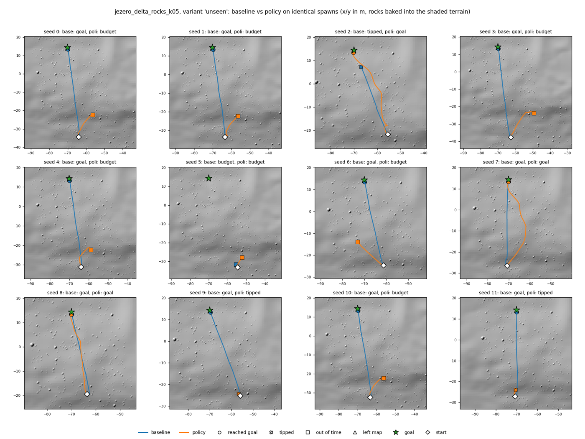
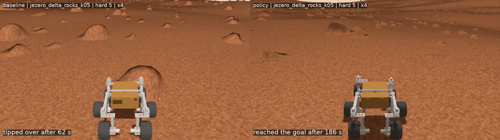

# jezero-lab — plan

**Goal:** train an RL policy that drives the JPL Open Source Rover v4 across a
simulated patch of Jezero Crater to a waypoint. Everything runs locally in Podman
on this machine (Fedora 44, 12 cores, 62 GB RAM, RX 7600): no cloud, no NVIDIA
dependency.

**Target stack:** Ubuntu 24.04 container → ROS 2 Jazzy + Gazebo Harmonic →
Gymnasium + Stable-Baselines3 (PyTorch, CPU) → TensorBoard.

**Starting constraint:** upstream `osr_gazebo` (in `nasa-jpl/osr-rover-code`) is
still **Gazebo Classic on ROS 2 Humble**. Classic went end-of-life in January 2025,
and "migrate to Harmonic / `ros_gz` for Jazzy" is an open follow-up in its README.
Phase 0 runs it as-is; Phase 1 ports it.

Lineage: successor to the 2020 AWS-JPL OSR Challenge work
(`joebarbere/AWS-JPL-OSR-Challenge`, branch `docker-cuda`). AWS RoboMaker, which
that challenge ran on, was discontinued on 2025-09-10.

---

## Phase 0 — Baseline on the upstream stack (~1 evening)

- Humble + Gazebo Classic container; run `osr_gazebo` exactly as published
  (`empty_world.launch.py` + teleop).
- GUI through X11/Wayland with `--device /dev/dri`, so rendering uses the AMD GPU
  via Mesa.
- **Done when:** you can drive the OSR with the keyboard. That is the known-good
  reference before anything changes.

### Phase 0 results — 2026-09-28

Upstream pinned at `6b17c22` (master, 2026-09-15; `v4.1.0-92`). Image
`jezero-lab:humble-classic`, 4.35 GB.

| Check | Result |
|---|---|
| Build | 4/4 packages (`osr_interfaces`, `osr_control`, `osr_bringup`, `osr_gazebo`) |
| Controllers | `joint_state_broadcaster`, `servo_controller`, `wheel_controller` all active |
| Rendering | hardware: `GFX1102` (RX 7600), Mesa 23.2.1, OpenGL 4.6 |
| Forward | 0.322 m/s for 0.3 commanded, measured against **sim** time |
| Rotate in place | `angular.y: 0.5` → ~26° yaw, ~5 cm drift |
| **Real-time factor** | **0.25**, same with and without GUI; `gzserver` pins one core |

**The RTF is the headline.** It isn't rendering; it's physics. Every `<collision>`
in `osr.urdf.xacro` is a full-resolution STL (44 MB total; `body.stl` alone is
11 MB, ~220k triangles). At 0.25× a single env gives RL a quarter of a
second of experience per second — Phase 4 would be unworkable as-is.

Baseline numbers for Phase 1 to match: **0.32 m/s at 0.3 commanded**, rotate-in-place
yaw sign negative for positive `angular.y`.

## Phase 1 — Port to Jazzy + Harmonic

- `gazebo_ros2_control` → `gz_ros2_control`; move the IMU plugin to its Harmonic
  equivalent; `spawn_entity.py` → `ros_gz_sim create`.
- Keep upstream's design where the sim reuses the rover's own `kinematics.py`, so
  sim and hardware share the same math.
- **Replace mesh collisions with primitives** (cylinders for wheels, boxes for body
  and links), keeping STLs as `<visual>` only. Phase 0 measured RTF 0.25 with
  mesh collisions. Target: RTF ≥ 5 headless — measure before and after, on Classic
  first if that's quicker, so the gain isn't confused with the Harmonic port.
- **Done when:** teleop behaves the same as Phase 0, including rotate-in-place
  (`angular.y`).
- Optional: open a pull request upstream, since it's their open follow-up.

### Phase 1 results — 2026-09-29

New package `ros_ws/src/osr_gz` (derived from upstream `osr_gazebo`, Apache-2.0),
built in both `jezero-lab:humble-classic` and `jezero-lab:jazzy-harmonic`:

```
ros2 launch osr_gz sim.launch.py [sim:=classic|harmonic] [collision:=primitive|mesh]
                                 [gui:=true|false] [realtime:=true|false [step:=0.005]]
```

Same link/joint names and inertials as upstream, the same `osr_control` rover
node + `kinematics.py`, and upstream's command adapter unchanged. Measured with
`containers/bench.sh` (`tools/bench.py`): forward speed and rotate-in-place
against sim time, heading from the IMU.

| Config | RTF | Forward (0.3 cmd) | Rotate, 4 sim-s |
|---|---|---|---|
| Phase 0: upstream, Classic, mesh | 0.24 | 0.325 | −84° |
| Classic, `osr_gz` mesh (parity check) | 0.26 | 0.322 | −83° |
| Classic, primitive, real time | 0.98 (capped) | 0.326 | −103° |
| **Harmonic, primitive, real time** | 1.00 (capped) | 0.328 | −116° |
| Harmonic, mesh, real time | 0.99 (capped) | 0.327 | −115° |
| Harmonic, primitive, unthrottled, 1 ms | 3.1 | 0.324 | −115° |
| Harmonic, primitive, unthrottled, 2 / 4 / 8 ms | 6.2 / 11.7 / 22.4 | 0.327–0.329 | −119° / −124° / −130° |
| **Harmonic, primitive, unthrottled, 5 ms (default)** | **~16** (gz `/stats`, idle/driving/rotating 16.3/15.6/16.6) | 0.327 | −124° |

Findings, in order of how much they matter:

- **Target met on Harmonic: ~16× real time** at the default 5 ms step, steady
  across idle, driving, and rotating. RTF scales ~linearly with step size.
  5 ms is the default because it divides the 100 Hz controller period.
  Rotate-in-place gets ~7% faster at 5 ms than at 1 ms (servo response to a
  coarser step); forward speed doesn't change.
- **Mesh collision is Classic's problem, not Harmonic's.** DART keeps up with
  real time even with the full STL collisions. Primitives are the default
  anyway; they're what makes unthrottled stepping fast, and the terrain in
  Phase 2 will cost more contacts.
- **Classic's unthrottled RTF is state-dependent and unreliable**: 1.5–11× at
  1 ms depending on what the rover is doing (gz stats: 10.9 idle vs ~1.7 after
  driving). Two early bench readings (10.4, 40.9) came from that variance. Not
  pursued: Classic is only the Phase 0 reference now.
- **Rotate-in-place differs by simulator** (−84° upstream mesh, −103° Classic
  primitive, −116° Harmonic). Forward speed matches everywhere. Direction and
  sign match Phase 0. Contact geometry (mesh treads vs cylinders) and engine
  (ODE vs DART) both move it. Acceptable for RL; don't treat rotate rate as
  ground truth for the physical rover.
- **Bullet-Featherstone was tried and rejected**: 3.8× at 1 ms (vs DART 3.1) but
  the rover barely drives (0.23 m/s, −7° rotate). Joint control behaves
  differently there.
- **Harmonic bridges `/clock` on every physics step.** A Python node on sim time
  burned a full core just receiving it unthrottled. The rover node and command
  adapter never read the clock, so they run on wall time (as upstream runs them).
- **Humble `gazebo_ros2_control` can't take XML comments in `robot_description`**
  (it passes the URDF as an rcl command-line override). The launch file strips
  them.

Carried into Phase 2 (upstream model issues, left as-is for parity):

- **Wheel radius mismatch.** Mesh tyre radius is 0.082 m; `osr_params.yaml` says
  0.075. Every sim runs ~9% fast (0.3 → ~0.327). Decide which is right for the
  physical v4 rover before training on speed.
- **Upstream friction was never applied.** `<surface><friction>` inside URDF
  `<collision>` is dropped in URDF→SDF conversion (`gz sdf -p`: 6 `<mu>` in, 0
  out); wheels have always run on the simulator default. Set it deliberately with
  `<gazebo reference>` for Mars regolith.
- **The rocker pivot is fixed.** `rocker_bogie_joint_*_1` is `type="fixed"`; only
  the bogie articulates. Irrelevant on flat ground, wrong on Jezero terrain.
- **Primitive mode has no collision on rockers, bogies, or brackets.** Fine on
  flat ground; on rocks they need capsules/boxes so the rover can high-centre.

## Phase 2 — Jezero world

- Download a HiRISE DTM of the Jezero delta; crop to a drivable patch of a few
  hundred metres.
- Load it as a Gazebo DEM heightmap; set gravity to 3.721 m/s².
- 3–5 waypoints loosely following Perseverance's route up the delta.
- **Done when:** the rover spawns on the terrain and drives without sinking through
  it or bouncing off.

### Phase 2 results — 2026-09-29

```
ros2 launch osr_gz sim.launch.py world:=jezero_delta [realtime:=false]
```

**Terrain.** 256 m × 256 m of the Jezero delta front, 65.8 m of relief, from the
USGS Mars 2020 TRN HiRISE DTM mosaic (1 m/px, Fergason et al. 2020,
doi:10.5066/P9REJ9JN). `terrain/fetch_dtm.sh` reads just the window over HTTP
(the mosaic is uncompressed and row-striped, so a 257-row crop is ~22 MB of the
1.8 GB file, ~20 s). `terrain/build_jezero_delta.sh` rebuilds everything.

- **Where:** the 256 m window along Perseverance's traverse with the most climb
  while staying on the delta: sols 437–708, 41 route points. (The steepest window
  overall, sols 1244–1254 with 64 m of route climb, is the crater rim, left for later.)
- **Waypoints:** NASA's M20 waypoint file (MMGIS), lat/lon converted to the DTM's
  projection (x = R·lon, y = R·lat, R = 3,396,190 m). **NASA's recorded elevation
  matches the DTM within 0.1–0.4 m at every waypoint**, which validates the
  conversion. Five waypoints, sols 437 → 441 → 448 → 455 → 461: ~300 m of real
  route, climbing 16 m (z 3.3 → 19.3).
- **Slopes:** median 9.3°, 21% of cells > 15°, 7.5% > 20°, 0.9% > 30°, max 42.8°.
- **Loading:** 16-bit PNG heightmap with an explicit `<size>` (not a georeferenced
  DEM: Harmonic's DEM loader assumes Earth for geographic rasters, and the PNG
  path has fewer unknowns). Own regolith-coloured texture: Gazebo's stock terrain
  textures aren't installed with the Harmonic packages. Mars gravity 3.721 m/s².
  Waypoints are visual-only blue posts; spawn pose and waypoints are also in
  `worlds/jezero_delta.yaml` for Phase 3.

**Checks:**

| Check | Result |
|---|---|
| Heightmap orientation/scale | settled at z = 3.24 m at the sol 437 spawn; DTM says 3.29 m. Row-flipped would be 35.3, column-flipped 5.9 |
| Settling | pose identical over repeated reads after spawn on a ~7° slope: no sinking, bouncing, or sliding |
| Drive to sol 441 | straight at 0.3 m/s for 121 sim-s: 33.6 m, +3.6 m climb, ending 1.7 m from Perseverance's sol 441 position (33.2 m away). 0.28 m/s average; pitch up to 11° |
| RTF, unthrottled (gz `/stats`) | **Jezero 21–22×**, flat 15.5–16× (heightmap contact is cheaper for DART than the ground plane) |

**Model fixes (both simulators):**

- **Wheel radius:** the sim now passes `rover_dimensions.wheel_radius: 0.082` to
  the rover node (the simulated wheel; upstream's `rover_bringup.md` shows 0.082
  as the override). Forward speed went from 0.327 to **0.300 m/s** for 0.3
  commanded, on Harmonic and Classic.
- **Friction:** `wheel_mu:=` (default 0.7, upstream's intended μ) applied via
  `<gazebo reference>`, which does survive URDF→SDF (6 `<mu>` in the SDF, vs 0
  from upstream's `<surface>` block). Isotropic: upstream's μ2 = 0.3 has no
  defined direction without `fdir1`. No RTF cost (μ 0.7 vs 1.0: identical).
- Rotate-in-place is now −103° / 4 s real time on Harmonic, −94° on Classic (it
  goes through the wheel-radius math too).

**Tried and rejected: the rocker differential.** URDF `<mimic>` (left rocker =
−right) converts to SDF correctly, but DART in Harmonic refuses it at runtime:
"the chosen physics engine does not support mimic constraints". Without it the
body is free to pitch and flopped to −35°. Rockers stay fixed as upstream has them;
the bogies articulate, and the drive above shows that's enough on 1 m terrain.
Real fix: a small gz-sim system plugin applying the differential as a torque
coupling (τ ∝ −(θ_L + θ_R)). Bullet-Featherstone supports mimic but failed Phase 1's
drive test.

**Deferred to Phase 4 (boulder fields):** primitive collisions on rockers, bogies,
and brackets, so the rover can high-centre on rocks. A 1 m DTM has no rocks, so
nothing can touch them here.

**Tooling:** `tools/drive_test.py` (drive straight, log pose/tilt);
`tools/bench.py` now takes RTF from gz `/stats` on Harmonic, waits for `/cmd_vel`
to have a reader before timing (DDS discovery is ~1–2 s of wall time = tens of
sim-seconds unthrottled), and shuts its executor down cleanly.

## Phase 3 — Gym environment

`JezeroEnv(gymnasium.Env)`:

- **Observation:** pose, vector to goal, IMU, a small patch of terrain height samples
  around the rover. No camera at first; rendering cameras is where CPU-only training
  slows down.
- **Action:** continuous `[linear, angular]`, turned into wheel speeds and steering
  angles by `kinematics.py`.
- **Reward:** port of the 2020 reward: keep `at_destination()` with its bounding box,
  add penalties for tipping and collisions, and a step budget standing in for the
  power supply.
- **Reset:** full world and joint reset. Joint state not resetting cleanly was the
  2020 bug, so test reset first.
- Training code controls stepping (fixed physics steps per action) instead of the
  sim running in real time. **Spike early:** measure the gz Python API against a ROS
  bridge for step speed; keep ROS out of the training loop if the bridge is slow.
- **Done when:** a random agent runs 1,000 episodes without the sim hanging or
  leaking memory.

### Phase 3 results — 2026-09-29

`jezero_env/`: a Gymnasium env with **no ROS in the training loop**. Run anything
in it through `jezero_env/run.sh` inside the `jazzy-harmonic` image.

**Spike outcome: in-process gz-sim, not a ROS bridge.** ROS couldn't give
deterministic stepping: /cmd_vel → rover node → adapter → controllers is async on
wall time, which at 15–20× RTF is many sim-steps of lag. Instead `jezero_env/sim.py`
runs the gz-sim server inside the Python process (`gz.sim8.TestFixture`), applies
commands to the joints in a pre-update callback every physics step, and
`step(n)` returns after exactly n steps. It uses the rover's own
`osr_control.kinematics` (pure Python, no ROS imports) and upstream's adapter sign
conventions, so an action drives the wheels exactly as `/cmd_vel` does.

Parity with the ROS stack, same 5 ms step: forward **0.300 m/s** (ROS 0.298–0.301),
rotate-in-place **−111°** / 4 s (ROS −112°), **14–15×** RTF in one process.

What it took (each of these silently broke the sim until found):

- **The gz Python bindings aren't in ROS's gz vendor packages.** They come from the
  OSRF apt repo (`python3-gz-sim8`, `python3-gz-transport13`, `libgz-sim8-plugins`),
  which installs a second, system copy of Harmonic (8.15) under `/usr`, next to
  ROS's vendor copy (8.11). The ROS image's `LD_LIBRARY_PATH` points at the vendor
  copy (undefined symbols), so `run.sh` sets `LD_LIBRARY_PATH=/usr/lib/x86_64-linux-gnu`.
  The ROS stack is unaffected: it still resolves the vendor `gz` (bench after the
  change: 0.298 m/s, −112°), and the parity numbers above show the two minor
  versions behave the same. The dartsim engine
  plugin also needs its unversioned alias (`libgz-physics-dartsim-plugin.so`),
  which only the -dev package ships; the image links it.
- `import gz.math7` is required before `gz.sim8` returns poses, or pybind can't
  convert them (hard crash in the callback).
- **Per-instance `GZ_PARTITION`.** gz-transport is host-wide: two sims (in one
  process, or across a `SubprocVecEnv`) advertise the same `/world/<name>/…`
  services and answer each other's requests. Each `JezeroSim` sets its own.

**Reset — the 2020 bug — took three tries:**

1. `Server.reset_all()`: in gz-sim 8.15 it stops TestFixture's pre-update callback
   from firing afterwards. The rover resets, then ignores every command.
2. Teleport + zero every joint: `Link` velocity commands **persist every step**
   (the body hovered, pinned at zero velocity); without them, the body keeps its
   momentum through the teleport — after different histories, the same episode
   drifted apart by 8 cm in 2 s.
3. **Delete the rover and spawn a fresh one** (`/world/<name>/remove` + `create`,
   called while the server steps in the background — the bindings release the
   GIL, so it doesn't deadlock). A service reply only means "queued", so reset
   steps until the old model is gone and the new one exists before continuing.

Result: after three different histories (driving, spinning, reversing while
turning), the following episode is **identical: 0.000 mm, 0.0000° spread**. Reset
takes 160–175 ms. Gymnasium's `check_env` passes, including its same-seed reset
check.

**Settling after spawn.** The first soak (1,000 random episodes) scored 29% of
episodes as tipped. All of them tipped on **step 1**, at 40–46° pitch, and 26 of
27 were back to ~10° (the terrain slope) 3 s later: the rover was still rocking
from the drop when the episode started. With fixed rockers the body pivots on the
undamped bogie joints, and at 0.38 g that swing is slow; the fixed 1 s settle
wasn't enough. Reset now settles until the body is still (speed < 0.01 m/s,
angular speed < 0.02 rad/s for 0.5 s; median 3.0 sim-s, p95 4.2), and the env
respawns with another heading if a spawn never settles (a heading across a steep
spot). Tips from random driving after that: **0 in 120 episodes** of the
characterisation run.

**The env** (`jezero_env/env.py`):

- Action `[speed, turn]` ∈ [−1, 1]² → 0.3 m/s, 0.6 rad/s → kinematics. 5 Hz control
  (40 physics steps of 5 ms).
- Observation, 61 floats: goal in rover frame + distance, heading error (sin/cos),
  roll, pitch, body-frame velocities and yaw rate, previous action, and a 7×7 terrain
  patch at 1 m spacing relative to the rover's height, sampled from the same
  heightmap the physics collides with (rover z 3.290 vs heightmap 3.300 at spawn).
- Reward, from 2020: progress toward the goal, a goal bonus scaled by budget left,
  `at_destination()` bounding box (±1 m), per-step time cost; terminate with a
  penalty on tipping past 35° or leaving the map; truncate when the step budget
  (the "power supply": 2.5× straight-line time) runs out.
- Reset settles the rover until it is still, and respawns with another heading if
  it never does (see above). `info` reports `settle_time` and `spawn_attempts`.
- Episodes are segments of Perseverance's route between waypoints; `segments=` and
  `random_heading=` pick the start.

**Baseline** (`python3 -m jezero_env.baseline`): turn toward the goal, drive, slow
when misaligned. **Reaches every goal, all 4 segments, the whole 235 m route**,
within ~1 m, using ~40% of the budget:

| Segment | Distance | Result | Sim time | Wall |
|---|---|---|---|---|
| sol 437 → 441 | 33.3 m | goal, 540/1385 steps | 108 s | 5.5 s |
| sol 441 → 448 | 104.7 m | goal, 1731/4362 | 346 s | 18.0 s |
| sol 448 → 455 | 53.8 m | goal, 882/2238 | 176 s | 9.1 s |
| sol 455 → 461 | 43.3 m | goal, 716/1802 | 143 s | 7.4 s |

**The task is too easy as-is**: on smooth 1 m terrain a trivial controller succeeds
100% from the default spawns, so "beat the baseline on success rate" can't be
Phase 4's bar here. See Phase 4.

**Soak — done-criterion met** (`python3 -m jezero_env.soak 1000 20`): 1,000
random-agent episodes (random segment and heading, 20 sim-s cap), 100,000 steps in
1,234 s:

| | |
|---|---|
| Hangs / crashes | none |
| Memory | +33 MB warm-up in the first 100 episodes, then +2 MB over the next 900 (~2 KB/episode: allocator noise, not a leak); peak 237 MB |
| Throughput | 81–84 env steps/s (5 Hz control → ~16× real time), one process |
| Reset | median ~0.2 s wall; worst 1.3 s (a respawn) |
| Respawns | 39 (3.9%) needed a second heading to settle |
| Terminations | 0 tipped, 0 out of bounds; all 1,000 hit the 20 s cap |

## Phase 4 — Training

- Parallel envs as separate processes (`SubprocVecEnv`); each `JezeroSim` already
  takes its own `GZ_PARTITION`, and there's no ROS in the loop, so no
  `ROS_DOMAIN_ID` needed. Start with 6–8, then tune based on CPU use.
- PPO first, then SAC. TensorBoard (replaces the 2020 ELK stack).
- Curriculum: flat ground, then the delta slope, then boulder fields.
- **Harder variants, because the baseline already succeeds 100% on the plain
  route:** random start headings, spawn points off the route, boulder fields (and
  primitive collisions on rockers/bogies so high-centring is possible), steeper
  terrain (the crater rim, sols 1244–1254).
- **Done when:** the policy beats the hand-written go-to-goal controller
  (`jezero_env/baseline.py`) on success rate on the harder variants, across
  held-out spawn points, and on time-to-goal on the plain route.
- Throughput to plan around: ~82 env steps/s per process. At 6–8 processes, ~500–650
  env steps/s, i.e. ~2M steps/hour, before PPO's own overhead.
- Worth trying: a little damping on the bogie joints. Real pivots have friction,
  and it would shorten the 3 s post-spawn settle that dominates reset time.

### Phase 4 results — in progress (2026-09-29)

**Tooling.** CPU-only PyTorch 2.14, Stable-Baselines3 2.9, TensorBoard 2.21 in the
image (5.9 GB). `train/train.py`: PPO, `SubprocVecEnv` (spawn start method, one
simulator + `GZ_PARTITION` per process), `VecNormalize` (saved with every
checkpoint), 2×128 MLP, torch on 2 threads, TensorBoard with outcome rates
(goal / tipped / budget / out of bounds). ~340 env steps/s with 6 simulators.
Training is deterministic end to end: a second run with the same seed matched the
first to the last digit at every logged step. `eval/evaluate.py` runs the policy
and the baseline on identical spawns (evaluation seeds from 1,000,000, far from
training's), in three variants: *plain* (segments 0–2, from the waypoint, facing
the goal), *hard* (random heading, 10 m jitter, held-out seeds), *unseen* (segment
3, never trained on). `tools/tb_summary.py` prints a run's curves.

**The plain delta can't show RL doing anything useful.** The baseline scores 100% on
*plain*, *hard* and *unseen*, at 0.30 m/s, i.e. flat out in a straight line. On a
smooth 1 m DTM, "point at the goal and drive" is near optimal. `ppo_v1` (1.0M
steps, segments 0–2, random heading, 10 m jitter; stopped early once it plateaued
at a 93–100% training goal rate):

| Variant | Baseline | ppo_v1 |
|---|---|---|
| plain | 100%, 0.305 m/s | 100%, 0.267 m/s |
| hard | 100%, 0.302 m/s | 92%, 0.241 m/s |
| unseen (segment 3) | 100%, 0.297 m/s | **42%**, 0.137 m/s |

It learned to drive, but slower than the baseline, and it **memorised its three
training segments**: 42% on the unseen one.

**Steepness doesn't help either.** `jezero_rim` (`terrain/build_jezero_rim.sh`):
Perseverance's crater-rim climb, sols 1244–1252, 89 m relief, median slope 15.5°,
56% of cells > 15°, max 30°. Built and kept, but in this sim a straight climb
isn't hard: wheel joints have no effort limit (and a realistic one wouldn't
matter: the drive config's 223 rpm matches goBILDA's 26.9:1 motor, stall ~3.7 N·m,
and a 20° climb at Mars gravity needs ~0.7 N·m per wheel for the ~42 kg model),
and μ = 0.7 only slips past ~35°.

**Rocks are what a small rover can't just drive through.** `terrain/add_rocks.py`
scatters rocks along the route with the **Golombek–Rapp** Mars rock-abundance model
(fractional area covered by rocks ≥ D: k·e^(−q(k)·D), q = 1.79 + 0.152/k),
diameters 0.2–1.5 m, spheres centred at ground level (D/2 tall), within 20 m of the
route, 2 m clear of waypoints. Measured coverage matches the model (k = 0.05: 2.0%
vs 1.9% predicted; k = 0.03: 0.7 vs 0.8; k = 0.08: 3.7 vs 3.8). k = 0.05 gives
2,544 rocks, 837 of them ≥ 0.3 m.

- **Rocks as models are unusable:** 2,544 separate models ran at **0.40×** real
  time (vs 12.6× without); one static model with 2,544 sphere collisions, 1.6×.
- **Rocks baked into the terrain cost nothing:** the heightmap is upsampled to
  2049×2049 (12.5 cm) and each rock's dome √(r² − d²) added. Heightfield
  collision only tests cells near the rover: **12.8×** with 2,544 rocks, 12.1×
  with 4,346. Trade-off: a rock is a dome sampled at 12.5 cm, not a sphere with
  vertical sides. Worlds: `jezero_delta_rocks_k03/k05/k08`.
- **They behave like rocks.** Driving straight at one: a 0.25 m rock (0.11 m tall)
  is driven over; 0.40 m (0.17 m) climbed at 24° pitch; 0.70 m (0.37 m) blocks the
  rover and deflects it 4.75 m sideways; 1.35 m (0.66 m) flips it over.
- **Suspension collisions:** the rocker, bogie and steering-bracket beams are now
  4 cm boxes between their joint origins (so the rover can high-centre).
  Flat-ground behaviour is unchanged to four decimals (they don't touch the ground).
- **The baseline fails in the boulder field** (k = 0.05, 12 episodes per variant):
  *plain* 75% (3 tip-overs), *hard* **42%** (5 tip-overs, 2 stuck), *unseen* 83%.
  Now there is something to learn.

**Env additions:** `spawn_jitter`; `rock_patch` (a 9×9 patch at 0.4 m of the
12.5 cm terrain, so the policy sees rocks; 142 floats in all); spawns and random
goals kept clear of rocks; `goal_mode='route'`: a random start and goal anywhere
along the training segments' route, 10–60 m apart, either direction, so the
policy can't memorise a few goals.

**`ppo_rocks`** (k = 0.05 boulders, `--rock-patch --goal-mode route`, segments
0–2, random heading, 10 m jitter). Training goal rate rose to 60–79% by ~1M steps
and stayed there; tipped 10–20%. At 2.7M steps it **crashed and hung**: one
worker's reset raised "no start/goal pair found along the route". The 1.5 m
goal-to-rock clearance left only 15% of route points eligible (0.8 m: 55%,
1.0 m: 42%), so 200 random tries failed ~1 reset in 1,000; the dead
`SubprocVecEnv` worker then left the main process blocked, not exited. Fixed:
1.0 m clearance, 2,000 tries, and a fallback to a segment's own (rock-free)
waypoints, so `_route_pair` can no longer raise. Evaluated from the 2.8M
checkpoint (12 held-out spawns per variant, identical for both controllers):

| Variant | Baseline | ppo_rocks | Paired: policy-only / baseline-only wins |
|---|---|---|---|
| plain | 75% (3 tipped) | 67% (3 tipped, 1 budget) | 0 / 1 |
| hard | 42% (5 tipped, 2 budget) | 50% (3 tipped, 3 budget) | 3 / 2 |
| unseen (segment 3) | **83%** | **25%** (7 budget, 2 tipped) | 1 / 8 |

**Phase 4's done-criterion is not met.** On *hard* the policy tips less and
wins slightly more (6/12 vs 5/12, within noise at n = 12); it doesn't win on
*plain*, and it still doesn't generalise: route goals didn't fix what
`ppo_v1` showed. On *unseen*, 7 policy episodes ran out of budget after moving
~10 m, and three (seeds 0, 1, 10) stall at exactly **39.2 m** from the goal: one
feature early in segment 3 that the policy can't get past and the baseline
drives straight by.

## Phase 5 — Evaluation and demo

- Eval script: fixed seeds, recorded videos, success rate and path-efficiency plots.
- Optional: camera observations, ROCm PyTorch on the RX 7600, sim-to-real prep for a
  physical OSR build.

### Phase 5 results — 2026-09-29

**ROCm: measured, and not worth it** (`tools/profile_train.py`). With 6 simulators,
a PPO iteration is 9.4 s of collecting rollouts and **0.18 s of network update:
2% of wall time**, so even an infinitely fast GPU would make training 1.02×
faster. More torch threads made it slightly slower (6 threads: 295 steps/s vs
321 with 2). A 2×128 MLP is too small for a GPU to matter, and gfx1102 is
outside ROCm's official support anyway. The time goes into the simulators, run
in lockstep: each vectorised step waits for the slowest simulator, and a reset
(0.2–1.3 s) stalls the other five, so 6 × 82 = 490 standalone steps/s becomes
~330. What would actually speed training up:

- a coarser physics step (RTF scales ~linearly with it; 10 ms if the rover stays
  stable),
- more simulators, up to the core count,
- not stalling on resets (asynchronous resets, or resetting in a background
  process while the others step).

Where the GPU *does* help is rendering, below.

**Path plots** (`eval/plot_paths.py`): each held-out spawn as a panel, baseline
and policy paths over the shaded boulder terrain, with how each ended; plus a
whole-map overview. `eval/evaluate.py` now records each episode's path (1 Hz).



They show *how* `ppo_rocks` fails on the unseen segment, which the success rates
couldn't: the goal is due north, and in seeds 0, 1, 3, 4, 10 the policy instead
heads **north-east**, drives ~10 m to nearly the same point (≈ −57, −22), and
stops there until its budget runs out, at the foot of an east–west scarp (the dark
band in the shading). The baseline drives straight north across it. So the policy
isn't just failing to handle a rock: off its training ground it drifts off the
goal bearing and stalls at a slope it avoids rather than climbs.

**Chase-camera video** (`eval/record.py`, `eval/make_demo.sh`): an optional camera
sensor on the rover (`camera:=true`, 1.6 m behind, 0.9 m up, 960×540 at 15 fps sim
time) and Gazebo's Sensors system, rendered with ogre2 on the RX 7600 (Mesa,
hardware GL) through the host display. Frames stream from the camera topic into
ffmpeg (a 3-minute episode held in memory would be ~4 GB). Recordings reproduce
the evaluation exactly: rendering doesn't perturb the physics. `make_demo.sh`
records baseline and policy from the same spawn and stacks them side by side
with outcome captions. Three demos, ~3.5 min to make all of them:

| Demo | Baseline (left) | Policy (right) |
|---|---|---|
| `hard_5` | tips over on a boulder at 62 s | steers around it, reaches the goal at 186 s |
| `unseen_0` | drives straight to the goal, 172 s | veers north-east, stalls 39.2 m out |
| `plain_1` | tips over on the same big rock at 136 s | tips over on it too, 134 s |



Videos are ~15–19 MB each, so they live in `runs/videos/` (not committed).

What rendering needed, on top of the Phase 3 setup: the OSRF
`libgz-rendering8-ogre2` package and its unversioned plugin aliases (the same
packaging gap as the physics plugin), and `GZ_RENDERING_RESOURCE_PATH` pointed at
ROS's vendor copy of the ogre2 shaders and media, since the OSRF package doesn't
ship them; both copies are gz-rendering 8.2.3. Waypoint markers are now 5 cm posts:
the rover spawns on one, and the old 15 cm post filled a third of the frame.

### Where this leaves the project

Built, and reproducible from this repo: the NASA-JPL OSR in Gazebo Harmonic on real
HiRISE terrain of Jezero with Perseverance's waypoints, Mars-realistic boulder
fields, a deterministic in-process Gymnasium env, PPO training, a paired
evaluation against a hand-written baseline, and plots and videos of both.

Not achieved: a policy that beats the baseline. On smooth terrain the baseline is
near-optimal; in boulders the policy tips less but doesn't generalise off its
training ground.

### What the 2020 challenge entrants tried (reviewed 2026-09-29)

All 104 forks of the challenge repo were checked; 17 branches have real changes.
The 2020 setup was different: the policy saw only a 160×120 camera image (no goal
vector) and chose among 3 steering actions at fixed throttle. Upstream also shipped
with bugs most forks fixed: the checkpoint x had the wrong sign (the goal was
unreachable; the 2020 `docker-cuda` branch fixed it too), and the collision flag
was misnamed so bumper termination never fired.

**With evidence** (rcampbell95, the only fork with results: TensorBoard logs,
~120–150k steps per run):

- **PPO was the only algorithm to reach the goal**: 14 of 630 episodes (2%). DQN and
  Rainbow on the same reward never got closer than 26–35 m of 44. Supports PPO with
  continuous actions.
- **A reward paid per step of survival teaches survival**: episode return rose while
  episodes just got longer, never nearer. jezero_env's progress + goal bonus + time
  cost avoids this.
- **Progress ÷ distance driven diverges** when the rover barely moves (Rainbow's
  return fell to ~−22k). Any efficiency term must be bounded.

**Untested there, and aimed at our failures:**

- **Stuck termination with a negative reward** (four forks ended episodes on no
  progress). Targets the scarp stall. Must be negative: ending at 0 would be a free
  escape from the time cost.
- **Reward for heading toward the goal**, e.g. the cosine between velocity and goal
  bearing (two forks tried variants: a rolling "fraction of steps closer", a penalty
  on steering changes). Targets the drift off the goal bearing on unseen terrain.
- **Early tip warning**: two forks terminated on high IMU acceleration. Here, a
  graded penalty on roll/pitch rate before the 35° limit.
- **Obstacle shaping**: upstream rewarded LiDAR clearance; here, max slope or step
  height from the 9×9 fine patch.

Nobody randomised starts or goals, or tested generalisation at all: every agent saw
one fixed route. Nothing there addresses our biggest failure.

### Observability for model work (2026-09-29)

Added before changing the reward, so each change can be measured: per-episode
reward components, stuck time, peak tilt, progress and path efficiency in
TensorBoard; `episodes.csv` + `eval/heatmap.py` for where episodes end; git
revision and config per run; and `eval/watch.py`, which evaluates every
checkpoint on held-out spawns (alongside training or as a backfill) and logs it
next to the training curves with the baseline as a reference line.

**The backfill changed the picture** (8 spawns per point, so ±1 episode = 12.5
points; read the shape, not single values):

| Checkpoint | ppo_v1 hard / unseen | ppo_rocks hard / unseen (tipped) |
|---|---|---|
| 100k | 62% / 0% | 0% / 0% |
| 400k–600k | 75% / 25% | 25% / 25% (50% / 75%) |
| 700k | **100% / 62%** | – |
| 1.0–1.1M | 88% / 38% | 38% / **38%** (38% / 50%) |
| 1.6M | – | **50%** / 25% |
| 2.1M | – | **50%** / 12% |
| 2.6M | – | **0%** / 25% (75% / 50%) |
| Baseline, same spawns | 100% / 100% | 38% / 75% |

Held-out performance **peaks mid-training and then falls**: unseen at 700k for
`ppo_v1`, ~1.1M for `ppo_rocks`, the signature of memorising the training ground.
Evaluating only the last checkpoint understated both runs, and `ppo_rocks` is
unstable late (hard 50% → 0% with 75% tip-overs at 2.6M). So: select
checkpoints by held-out score, consider a decaying learning rate, and use 16–24
spawns for any decision.

### Inputs the policy doesn't get yet (reviewed 2026-09-29)

Today it observes the goal (in the rover frame, and distance), heading error,
roll, pitch, body-frame velocities, yaw rate, the previous action, a 7×7 terrain
patch at 1 m (±3 m) and, with `rock_patch`, a 9×9 at 0.4 m (±1.6 m). Against the
failures seen so far:

0. **Bug: the policy can't see its clock.** The goal bonus is
   `100 × (1 − steps/budget)` and episodes truncate when the budget runs out,
   but neither steps nor budget is observed, so the reward isn't a function of
   what the policy sees. Fix: observe the fraction of budget remaining
   (`clock_obs`, on for every run from here).
1. **Proprioception.** Wheel speed vs body speed (slip: the scarp stall is wheels
   turning while the body doesn't move; the real OSR measures wheel speed with its
   RoboClaw encoders), roll/pitch *rates* (tip warning), bogie and steering angles
   (suspension articulation, high-centring), time since last progress (the policy
   can't tell "stuck for 20 s" from "just started").
2. **Look-ahead.** The coarse patch reaches ±3 m, i.e. 10 s of driving at
   0.3 m/s. A height profile along the goal bearing out to 10–15 m, plus slope
   summaries.
3. **Varied worlds, the generalisation lever** (simulator, not sensors). Rocks
   everywhere, start/goal pairs anywhere with a spatially held-out region, more
   HiRISE patches along Perseverance's route (the pipeline and `jezero_rim` exist)
   with whole terrains held out; randomised rock abundance (k 0.03–0.08), wheel
   friction (~0.5–0.9) and a little sensor noise.
4. **Privileged critic** (later). Simulator-only information (wheel contacts,
   true slip, exact rock distances) to the critic only, not the actor: faster
   learning without a policy that needs sensors the rover lacks.

Hardware check: upstream's OSR code reads motor encoders (RoboClaw) and battery
current (INA260) but has **no IMU driver**; the roll/pitch inputs assume one is
added (cheap).

### Experiment order (one change per run, same held-out spawns, `eval.watch --follow`)

| # | Run | Change | Status |
|---|---|---|---|
| 0 | `c0_control` | `ppo_rocks` setup + `clock_obs`, 1.5M | **invalid as a control**: also had goal clearance 1.0 m (see below) |
| 0b | `c0b_control` | `ppo_rocks` setup + `clock_obs`, goal clearance back to 1.5 m, 1.5M | done: **fails like c0** (training goal 7–15%, held-out 0%) |
| 0c | `c0c_control` | exactly the `ppo_rocks` setup on the current code, **no clock** | done: fails too (training goal 9–18%). See "Seed variance" |
| 0d | `clock_s0/s1/s2` | 3-seed screen (400k): clock on, vs the no-clock seeds already run | done: **clock hurts** (6/13/16% vs 69/92/75%); off |
| – | control | no clock, original reset, `ppo_rocks` setup: learns on 3/3 seeds (69–92% at 400k) | **established** |
| 0e | `bonusc_s0/s1/s2` | constant goal bonus instead of the decaying one | done: **no better** (70/92/13% vs 68/90/73%); not adopted |
| 1 | `exp1_map_s0/s1/s2` | varied worlds: rocks everywhere (`jezero_delta_rocks_k05_full`), goals anywhere (`--goal-mode map`), held-out region | done: **unseen 73% vs 46%** (non-overlapping seeds); **adopted as the new baseline**. More terrains still to do |
| 2 | `exp2_proprio_s0/s1/s2` | proprioception: wheel speeds, slip, roll/pitch rates, steering + bogie angles, no-progress time (16 inputs), on the exp1 baseline | done: **no measurable gain** (hard 52% = 52%, unseen 67% vs 73%); not adopted at 400k |
| 3 | `exp3_lookahead_s0/s1/s2` | look-ahead: terrain profiles on 5 rays around the goal bearing (±40°), 1.5–12 m (40 inputs), on the exp1 baseline | done: **worse at 400k** (hard 25% vs 52%, unseen 38% vs 73%); learns slower. Not adopted; see screening bias |
| 4a | `exp4a_stuck_s0/s1/s2` | stuck termination: no 0.25 m of progress in 30 s ends the episode at −50 (training only), on the exp1 baseline | done: **worse on hard** (25% vs 52%), unseen 62% vs 73%; not adopted |
| 4b, 4c | | heading-alignment term; tilt-rate penalty (each separately) | |
| 5 | | terrain CNN; privileged critic | |

### c0_control: why it isn't the control (2026-09-29)

It changed three things at once: the clock (intended); the reset fix (a
correctness fix, kept); and, unintentionally, goal-to-rock clearance 1.5 → 1.0 m,
which I'd lowered while fixing the `ppo_rocks` crash (the extra tries and the
fallback alone fix the crash). Result, far below `ppo_rocks`: training goal rate
9–21% (vs 60–79%), held-out *unseen* 0% at every checkpoint, *hard* ≤ 25%, and
74–83% of episodes timing out. Not freezing: timeouts drove a median ~47 m
(stuck only 10–14 s) and covered 67–79% of the way, but stalled a median 6.4 m
short of goals that now sit among rocks. **Goals among rocks are much harder**
(worth keeping as a later curriculum stage).

Also: the reset fix alone moved the baseline's score on the same 12 *hard* spawns
from 42% to 67%. Tip-overs among boulders are chaotic enough that small
differences at the start flip outcomes. From here the reference is always the
baseline on the current code, evaluated by the same watcher.

### c0b_control: the clock, or luck? (2026-09-30)

With the task restored, `c0b` still trained far below `ppo_rocks`: training goal
rate 7–15% at 1–1.5M (vs 60–79%), 78–87% timeouts, held-out hard 0% at every
checkpoint but one, unseen 0% throughout. Its timeouts aren't timid (median 53 m
driven, 13 s stuck, 78% of the way) but stall ~6 m from the goal.

**The environment isn't the problem**: `ppo_rocks` checkpoints trained on the old
code, evaluated on the current code, still work (1.1M: hard 50%, unseen 17%;
2.1M: hard **75%**, unseen 8%; baseline on the same spawns 67% / 83%). Left:
the clock observation itself, or run-to-run variance (the reset fix changes every
trajectory, so c0b is effectively another seed). `c0c` (no clock, current code)
separates them. If it fails too, results need several seeds per experiment.

### Seed variance, and the reset that trained less reliably (2026-09-30)

`c0c` (no clock) failed like `c0b`, so the clock wasn't it. Chasing the cause:

- **Not the environment**: `ppo_rocks` checkpoints still drive on the current code.
- **Not evaluator cross-talk**: gz-transport requests reach another process in the
  same container but not another container (tested directly, with a positive
  control).
- **Rerunning `ppo_rocks`'s own commit (4605519) learned again** (`c0d_oldcode`:
  81–91% training goal rate at 1.1–1.5M). Bisecting: current code with only
  `sim.py` rolled back to 4605519 learned, identically to 4605519 itself, digit
  for digit. The difference was the reset rewrite from `b8a770a` (settle
  schedule counted from the creation iteration, joints held from creation).
- But that rewrite doesn't change anything physical: velocities, corner angles,
  post-reset poses are the same, except the rest pose differs by ~3 µm. In a
  chaotic training loop that's enough to send a whole run elsewhere, so it's
  effectively a different seed.
- **Seeds, at 400k steps (training goal rate):**

  | Seed | Old reset | New reset |
  |---|---|---|
  | 0 | 69% | 8% |
  | 1 | **92%** | fail (`c0e`) |
  | 2 | 75% | **87%** |
  | `ppo_rocks` / `c0c` (6 envs) | learned | fail |

**Conclusions.**
1. **Seed variance is huge**: the same code gets 8% or 87%. Every single-run
   comparison made before this point is weak evidence, including `ppo_v1` vs
   `ppo_rocks` and the c0 series.
2. The old reset was more reliable (4/4 vs 1/4; ~5% odds if equal, no mechanism
   found). Reverted to it: training with it reproduces the old runs exactly, and
   `check_env` passes on the boulder world. Kept from the rewrite era: the camera
   option and exact episode time in `info`. Given up: bit-exact seeded resets
   after *different* histories (they differ by micrometres).
3. **Method from here: ≥ 3 seeds per setting**, 400k-step screening runs (curves
   separate by ~350k), full-length runs only for settings that survive
   screening; report the spread, not one run.

### The clock observation hurts (2026-09-30)

3 seeds each, training goal rate at 400k: **no clock 69% / 92% / 75%; with
clock 6% / 13% / 16%** (and `c0b`, a fourth clock run, also failed). The
"clock fix" made training much worse, although without it the reward depends on
something the policy can't see. Mechanism not confirmed; best guess: with the
clock visible the policy learns that a late finish earns almost no goal bonus
(it decays to 0 with the budget), weakening the pull to finish, which matches
the runs' symptom of stalling ~6 m short. `clock_obs` stays in the code, off by
default. The principled alternative is to remove the time dependence from the
reward instead: a constant goal bonus (the per-step time cost still rewards
finishing sooner), no clock needed.

### A constant goal bonus doesn't help (2026-09-30)

Training goal rate over 300–400k steps (and goal speed), constant bonus vs the
control: seed 0 70% (0.233 m/s) vs 68% (0.222); seed 1 92% (0.256) vs 90%
(0.248); **seed 2 13% vs 73%**. Two seeds match the control (slightly faster: the
fear that without a decaying bonus the policy would dawdle didn't materialise);
one failed. With seed variance this large that may be luck, but there's no
evidence of improvement, so it isn't adopted. In practice the hidden clock in the
decaying bonus doesn't hurt, and both fixes (observe it; remove it) were no
better or worse. **Baseline from here: the control** (decaying bonus, no clock,
original reset).

### Experiment 1: varied worlds generalise (2026-09-30)

Same held-out spawns for everyone, 16 per variant per seed, 400k checkpoints,
evaluated on `jezero_delta_rocks_k05_full` (`eval/compare.py`):

| | hard goal (tipped) | unseen goal (tipped) |
|---|---|---|
| baseline | 62% (31%) | 81% (6%) |
| control s0 / s1 / s2 | 44% / 50% / 12% | 31% / 56% / 50% |
| **control mean (range)** | **35%** (12–50) | **46%** (31–56) |
| exp1 s0 / s1 / s2 | 69% / 6% / **81%** | 62% / 69% / **88%** |
| **exp1 mean (range)** | **52%** (6–81) | **73%** (62–88) |

- **Unseen: a real improvement.** Every exp1 seed beats every control seed
  (35/48 vs 22/48 successes). Training on start/goal pairs everywhere teaches
  driving to a goal, not the route.
- **Hard: better on average, not conclusive** (one exp1 seed tips 56% of the time).
- **exp1 seed 2 is the first policy ahead of the baseline on both** (81 vs 62%,
  88 vs 81%); promising at n = 16, not proven.
- All 3 exp1 seeds learned (66–68% training goal rate on the harder map task).

**New baseline:** `--world jezero_delta_rocks_k05_full --goal-mode map`, plus the
control's settings. Experiments 2–5 build on it.

### Experiment 2: proprioception, no measurable gain at 400k (2026-09-30)

| | hard goal (tipped) | unseen goal (tipped) |
|---|---|---|
| exp1 s0 / s1 / s2 | 69 / 6 / 81% | 62 / 69 / 88% |
| **exp1 mean (range)** | **52%** (6–81) | **73%** (62–88) |
| exp2 s0 / s1 / s2 | 75 / 44 / 38% | 75 / 50 / 75% |
| **exp2 mean (range)** | **52%** (38–75) | **67%** (50–75) |

Pooled: hard 25/48 both; unseen 32/48 vs 35/48; hard tip-overs ~23% both.
Training goal rates were similar or slightly higher (71/76/71% vs 68/68/66%), and
one seed tipped much less in training (8% vs 24%), but that didn't carry to the
held-out spawns. Not adopted: it adds inputs (and hardware) with no measured gain.
Caveat: 400k may be too short to learn to use 16 new inputs; worth a retry at
full length if tip-overs and stalls persist in the final configuration.

### Experiment 3: look-ahead, worse at 400k, and a screening bias (2026-09-30)

| | hard goal (tipped) | unseen goal (tipped) |
|---|---|---|
| **exp1 mean (range)** | **52%** (6–81) | **73%** (62–88) |
| exp3 s0 / s1 / s2 | 0 / 50 / 25% | 38 / 19 / 56% |
| **exp3 mean (range)** | **25%** (0–50) | **38%** (19–56) |

All three look-ahead seeds trail on unseen, the variant it targeted, and tip more.
The training curves say *slower*, not *wrong*: 49–52% training goal rate at 400k vs
66–68% for exp1. 40 more inputs (+30%) take a small MLP longer to use.

**Screening bias:** a 400k screen penalises any change that adds inputs. That
applies to experiment 2 too. Neither result means "these inputs don't help";
both mean "not within 400k with a flat MLP". Reward changes (experiment 4) leave
the observation alone and are fair to screen at 400k. Input changes need longer
screens (~1M) or a model that handles them better (the terrain CNN,
experiment 5).

### Experiment 4a: stuck termination makes *hard* worse (2026-09-30)

| | hard goal (tipped) | unseen goal (tipped) |
|---|---|---|
| **exp1 mean (range)** | **52%** (6–81) | **73%** (62–88) |
| exp4a s0 / s1 / s2 | 6 / 25 / 44% | 88 / 75 / 25% |
| **exp4a mean (range)** | **25%** (6–44) | **62%** (25–88) |

Hard is clearly worse (every seed at or below exp1's mean); unseen about the
same. In training the rule fired a lot (seed 2: 38–49% of episodes ended
"stuck" late in training), so 30 s without 0.25 m of progress probably also
catches legitimate manoeuvring among rocks, punishing the careful driving *hard*
needs. And it doesn't catch slow crawls: seed 0 still timed out on 25% of
episodes. Not adopted; a longer limit is untested.

**Scorecard after experiment 4a** (400k, 3 seeds, same held-out spawns): only
experiment 1 helped; clock and constant bonus hurt or didn't help; proprioception
no measurable gain; look-ahead worse; stuck termination worse. Since experiment 1,
every change has been neutral or worse at 400k, which raises the question of
whether 400k screens can show most changes at all.

**Sensor policy (decided 2026-09-29):** any input a buyable sensor could provide
is allowed; each is tagged with the hardware it implies (the running bill of
materials: IMU ~$25–35, bogie-angle encoders, feedback servos, a depth camera for
terrain). Terrain inputs start idealised (ground-truth heightmap, 360°) but must
be re-tested with a realistic simulated camera (forward field of view,
occlusion, noise, latency) before any claim about hardware. Inputs no sensor
can provide (contacts, true slip, exact rock distances) go to the critic only.

### Next steps, if picked up again

1. Start and goal pairs across the whole map, not just along the route, with a
   spatially held-out region for evaluation, and evaluation at n ≥ 50.
2. Reward changes from the review above, **one at a time, each measured**: stuck
   termination with a penalty, a bounded heading-alignment term, a tilt-rate
   penalty.
3. The scarp stall: look at what the policy sees there (the 7×7 patch at 1 m may
   read a 10–15° scarp as a wall). A small CNN over the terrain patches (SB3
   feature extractor) fits their grid structure better than the flat MLP;
   network size itself isn't the constraint (the update is 2% of training time).
4. A stronger baseline with simple rock avoidance from the same fine patch, so a
   policy win means something.
5. Training speed per the profile above: coarser step, more simulators, no reset
   stalls. If a framework change is wanted for this, Sample Factory (asynchronous
   rollouts) is the one that addresses the lockstep bottleneck; SB3 already covers
   the model changes above. Swap plan: a framework-neutral `load_policy()` for
   eval/record, then reproduce `ppo_v1`'s plain-delta numbers before moving on.

---

## Repo layout

```
jezero-lab/
├── containers/       # Containerfile(s), GUI/run scripts
├── ros_ws/src/       # osr-rover-code (git submodule, pinned) + jezero_world pkg
├── terrain/          # DTM fetch + crop + heightmap conversion scripts
├── jezero_env/       # Gymnasium env, reward, reset logic
├── train/            # SB3 configs, launch N sims, TensorBoard logs → runs/
└── eval/             # eval + video recording
```

## Risks to watch

- **Sim speed on CPU.** Rocker-bogie physics on bumpy terrain might not run much
  faster than real time. Measure in Phase 3 before building on it; fall back to
  simpler terrain for early training.
- **The port may take longer than a weekend,** mostly because of controller setup in
  `gz_ros2_control`. Phase 0 exists so there's always something working to fall back to.
- **HiRISE files are large.** Crop hard; a first policy doesn't need cm resolution.
- **Disk:** `/home` was at 94% (59 GB free) on 2026-09-28. Each ROS desktop image is
  several GB; prune old images between phases.
