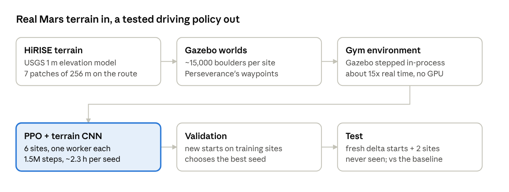

# jezero-lab: teaching a rover to drive Jezero Crater

Joe Barbere · October 10, 2026

A reinforcement-learning policy for NASA-JPL's Open Source Rover now beats a hand-written go-to-goal controller on every test set: 88% vs 50% goal rate among boulders on the Jezero delta, and 88–98% vs 71–73% on the hard starts at two sites it never trained on, while tipping over in 0–4% of episodes. Everything runs locally on one desktop (12 CPU cores, no GPU).

## Results

The chosen policy reaches the goal more often than the baseline on all six test sets, by 4 to 38 points. It was picked on a separate validation set, so the test numbers aren't inflated by selection.

| Test set | Baseline goal rate | Policy goal rate | Baseline tip-overs | Policy tip-overs |
| --- | --- | --- | --- | --- |
| Delta, hard starts (among boulders) | 50% | **88%** | 41% | 3% |
| Delta, unseen segment (the scarp) | 69% | **78%** | 19% | 3% |
| Site A (never trained on), hard | 71% | **98%** | 17% | 2% |
| Site A, unseen routes | 79% | **90%** | 6% | 2% |
| Site B (never trained on), hard | 73% | **88%** | 17% | 4% |
| Site B, unseen routes | 96% | **100%** | 0% | 0% |

Delta: 32 fresh starts per test; sites A and B: 48 per test. "Hard" starts face a random direction up to 10 m from the route among Mars-realistic boulder fields. The baseline turns toward the goal and drives. Tiny observation noise flips 12% of individual episodes, but the rates stay within sampling noise (89% vs 91% pooled), so they describe the policy, not one exact run.

## How it works

Real orbital elevation data becomes simulator worlds with Mars-like boulder fields. A Gymnasium environment steps the simulator directly, and PPO trains a small CNN policy across six sites; validation picks the seed, and the test sets only report.

## How we got there

Four changes made the difference: varied training worlds, a decaying learning rate, a CNN that reads the terrain as grids, and training on six sites. Every input added to the observation as raw numbers failed. Each experiment ran three or more random seeds, because one seed can land 20 points away from another.

| # | What changed | Result (delta, hard / unseen goal rate) | Decision |
| --- | --- | --- | --- |
| — | Hand-written baseline: turn to the goal and drive | 50% / 69% | Reference |
| 1 | Rocks everywhere, start and goal anywhere on the map, a held-out region | Large gain over route-only training | Adopted |
| 2 | Body sensors (wheel speeds, suspension angles) | No gain | Dropped |
| 3 | Look-ahead terrain profiles along the goal bearing | Worse | Dropped |
| 4a | Penalty for getting stuck | No gain | Dropped |
| 5 | Learning rate decaying to zero, 1.5M steps | 58% / 66% | Adopted |
| 6 | Look-ahead again, at full length | 47% / 49% | Dropped |
| 7 | Terrain CNN instead of a flat network | 67% / 66% | Adopted |
| 8 | Train on six sites along Perseverance's route, not one | 71% / 76% | Adopted |
| 9 | Six seeds; choose the seed on a validation set | Chosen policy 88% / 78% | Adopted procedure |
| 10 | Batch doubled to 6,144 samples per update | Per-seed average 85% vs 79%; worst seed 74% vs 64% | Adopted |

Rows 5–8 and 10 are means over seeds on 32 fresh starts; row 9 is the single chosen policy. Earlier rows were short 400k-step screens whose exact numbers aren't comparable, so only the direction is shown. The full reasoning, with numbers and an explainer for each step, is in the [decision log](decision_log.md) (D1–D33).

## What we learned

Most of the progress came from testing honestly, not from clever additions.

- **One seed proves nothing.** Seeds of the same recipe differed by up to 28 points, so every claim rests on three to six seeds.
- **The right information needs a usable form.** Look-ahead and body sensors failed as raw numbers; a CNN made the existing terrain grids pay off.
- **Short screens are biased.** 400k-step tests punished bigger observations; full-length runs settled those questions.
- **One test set is a sample of one.** New held-out sites showed the old "unseen" segment was the hardest place on the map, not a typical one.
- **Keep choosing and reporting separate.** Validation picked the seed; the test sets were only used to report. Validation could pick seeds (big differences) but not checkpoints (small ones).
- **Report rates, not episodes.** Among boulders a fifth-decimal difference flips single episodes; success rates held under perturbation.
- **Steadier updates beat more updates.** Doubling the batch cut seed spread at the same cost.

## Side work

Two pieces reach beyond the RL policy: fixes offered back to the OSR project, and a natural-language demo.

- **OSR upstream.** Building the simulator turned up real bugs in [osr-rover-code](https://github.com/nasa-jpl/osr-rover-code)'s Gazebo setup. [PR #230](https://github.com/nasa-jpl/osr-rover-code/pull/230) applies wheel friction correctly (open, last reply 2026-10-01). [Issue #229](https://github.com/nasa-jpl/osr-rover-code/issues/229) reports a wheel-radius mismatch that makes the sim drive about 9% fast. [Issue #228](https://github.com/nasa-jpl/osr-rover-code/issues/228) proposes moving to Gazebo Harmonic; a working port is ready on a branch, held until the maintainer answers. No replies on the issues yet.
- **Talk to the rover.** [ROSA](https://github.com/nasa-jpl/rosa), NASA-JPL's LLM agent for ROS, now drives the simulated rover with Claude: "drive to the nearest waypoint", "which controllers are running?". Its rover tools stop on their own past 25° of tilt. The tools are tested against the simulator; a conversation with the agent hasn't been tried yet (it needs an API key).
- **Not adopted after review:** GRPO and its credit-assignment fixes (built for LLMs; our small critic already does that job), Jev (a classification API, not a controller) and SPOC-Lite (a dormant 2017 terrain classifier for camera images).

## Next steps

The best next lever is making every seed good, so a single training run is enough; the batch result points that way.

- [ ] **Push the batch further:** 4× the original (12,288 samples per update), six seeds, compared with the 1× and 2× arms (about 10 h).
- [ ] **Pick from the new seeds too:** score the six bigger-batch seeds on validation; replace the chosen policy if one beats it.
- [ ] **Try the ROSA agent in conversation** ([rosa/](../rosa/README.md)) with an API key, then shape it into a small example for the OSR community.
- [ ] **Follow up upstream:** answer review on PR #230; send the Harmonic port once #228 gets a reply.
- [ ] **Remaining training ideas:** a critic that sees simulation-only facts during training (wheel contacts, slip), and a tilt-rate penalty aimed at the last tip-overs.
- [ ] **Toward the real rover:** add an IMU to the physical OSR (the policy uses roll and pitch) and plan a sim-to-real test.

## Sources

- [jezero-lab repository](https://github.com/joebarbere/jezero-lab): code, [PLAN.md](../PLAN.md) (every measured result) and the [decision log](decision_log.md) (D1–D33 with explainers)
- [NASA-JPL Open Source Rover](https://github.com/nasa-jpl/osr-rover-code)
- [USGS Mars 2020 HiRISE terrain (1 m DTM)](https://planetarymaps.usgs.gov/mosaic/mars2020_trn/HiRISE/) and [Perseverance waypoints (NASA MMGIS)](https://mars.nasa.gov/mmgis-maps/M20/Layers/json/M20_waypoints.json)
- [ROSA](https://github.com/nasa-jpl/rosa)
